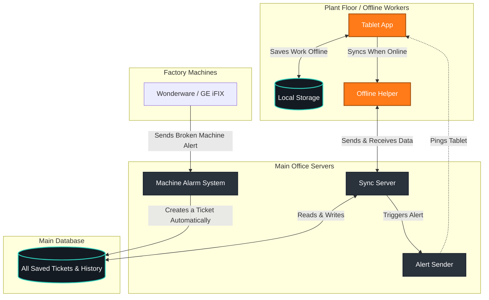

# 🏭 AGAC SupportDesk

A fast, reliable app for plant workers to report machine problems and read manuals, even when the internet is completely down. When the internet comes back, the app automatically sends all saved work to the main office.

---

## 🏗️ How the System Works

---

## ⚙️ Core Enterprise Pillars

Bidirectional Offline Sync: Employs a localRev vs. serverRev tracking system. Automatically resolves offline editing conflicts by routing contested tickets to a quarantine queue for dispatcher review.

Strict SLA Engine: Calculates millisecond-accurate Response and Resolution deadlines based on a predefined Severity Matrix (Sev 1 - Sev 4). Features automated timer pauses and escalation triggers.

Immutable Audit Ledger: Database-level enforcement (REVOKE UPDATE, DELETE) ensures every status change, SLA pause, and Root Cause Analysis (RCA) submission is permanently recorded for regulatory compliance.

Telemetry Ingestion: Exposes secure webhook endpoints allowing plant-floor alarm servers to automatically generate Severity 1 tickets when critical equipment tags drop offline.

Role-Based Access Control (RBAC): Distinct workflows for field_engineer, supervisor, and client.

🔄 Ticket Lifecycle & State Machine
To enforce compliance, tickets cannot jump states arbitrarily. The database and PWA UI enforce strict pathing, requiring mandatory Root Cause Analysis (RCA) data before a ticket can be resolved, and Supervisor Verification before it can be closed.

stateDiagram-v2
    [*] --> Open : Telemetry or Manual Log
    Open --> Assigned : Dispatcher Assigns
    
    state "Active Investigation" as Active {
        Assigned --> In_Progress : Engineer Starts Work
        In_Progress --> Pending_Info : SLA Clock Paused
        Pending_Info --> In_Progress : SLA Clock Resumed
    }
    
    Active --> Resolved : Requires RCA & Linked SCADA Node
    Resolved --> Active : Fix Failed (Reopened)
    Resolved --> Closed : Supervisor Verifies Fix
    Closed --> [*]

🗄️ Database Architecture (v2)
The local IndexedDB mirrors the central PostgreSQL schema to ensure flawless 1:1 synchronization.

Store / Table,Key,Purpose
tickets,ticketId (UUID),"Full-lifecycle incident records including RCA data, photo references, and active SLA clocks."
audit_log,auditId (Serial),"Append-only ledger tracking every action, user ID, and timestamp for compliance auditing."
sla_policies,severity (1-4),Enterprise response/resolution matrices governing compliance deadlines and escalation chains.
sync_conflicts,conflictId,Quarantine zone for tickets edited simultaneously by an offline field engineer and the central server.
equipment_tags,tagId,"Known PLC/HMI/RTU physical assets, indexed by system platform (Wonderware, TIA Portal, iFIX)."
knowledge_articles,articleId,Cached troubleshooting SOPs pulled via stale-while-revalidate for immediate offline diagnostics.

🔀 Bidirectional Sync & Conflict Protocol
When an engineer regains Wi-Fi/4G connectivity, the Service Worker executes a background synchronization protocol to merge local changes with the central database safely.

sequenceDiagram
    participant IDB as Local IndexedDB
    participant SW as Service Worker
    participant API as Enterprise Backend
    participant PG as PostgreSQL DB

    Note over IDB,PG: Connection Restored
    SW->>IDB: 1. Read queued offline tickets
    SW->>API: 2. PULL: Fetch server tickets since lastSync
    API->>PG: Query latest revisions
    PG-->>API: Return server updates
    API-->>SW: Server payload
    
    alt Local & Server match or Local is newer
        SW->>IDB: 3. Merge server changes safely
    else Conflict (Both edited simultaneously)
        SW->>IDB: Route to 'sync_conflicts' table
        SW->>UI: Trigger "Merge Resolution" Dialog
    end

    SW->>API: 4. PUSH: Send local queued updates
    API->>PG: Commit validated changes
    PG-->>API: 200 OK + New serverRev
    API-->>SW: Confirm Sync
    SW->>IDB: 5. Mark as 'synced', update serverRev

🛠️ Local Development & Deployment
Prerequisites
Node.js v18+

PostgreSQL 14+

Setup

1.Clone & Install:
git clone [https://github.com/your-org/AGAC-SCADA-SupportDesk.git](https://github.com/your-org/AGAC-SCADA-SupportDesk.git)
cd AGAC-SCADA-SupportDesk
npm install

2. Database Initialization:
Execute the backend/schema.sql file against your local Postgres instance to generate the enterprise schema, enums, and check constraints.

3. Run Dev Server:
npm run dev

Starts the local HTTP server on http://localhost:8080. Service Workers operate normally on localhost without HTTPS.

Offline Testing
1. Load the app at http://localhost:8080.
2. Open Chrome DevTools ➡️ Application tab ➡️ Service Workers ➡️ check Offline.
3. Create a ticket, pause an SLA, or resolve an issue. Ensure changes queue locally.
4. Uncheck Offline to observe the background sync engine reconcile changes via the Network tab.
