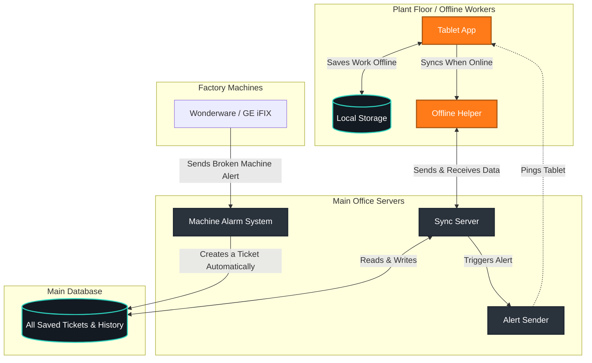

# 🏭 AGAC SupportDesk

A fast, reliable app for plant workers to report machine problems and read manuals, even when the internet is completely down. When the internet comes back, the app automatically sends all saved work to the main office.

---

## 🏗️ How the System Works

---

## ⚙️ Main Features (Explained Simply)
Two-Way Sync: If you work without internet, the app saves everything. When the internet comes back, it carefully shares your updates with the main office so no work is lost.

Strict Timers: The app puts a countdown clock on every problem to make sure engineers fix things fast.

Permanent History Book: The app writes down everything anyone does. No one can delete or hide their past mistakes.

Automatic Machine Alarms: If a machine breaks down, it automatically tells the app and creates a ticket for an engineer.

User Rules: Engineers, bosses, and clients only see the screens they are allowed to see.

## 🔄 How a Problem Gets Fixed

Tickets must follow strict rules. An engineer must explain how they fixed a problem before they can mark it as "Resolved."

stateDiagram-v2
    [*] --> Open : New Problem Found
    Open --> Assigned : Boss Gives Problem to Engineer
    
    state "Fixing the Problem" as Active {
        Assigned --> In_Progress : Engineer Starts Work
        In_Progress --> Pending_Info : Waiting for Help (Timer Paused)
        Pending_Info --> In_Progress : Got Help (Timer Restarts)
    }
    
    Active --> Resolved : Engineer Explains the Fix
    Resolved --> Active : Fix Failed (Try Again)
    Resolved --> Closed : Boss Checks the Work
    Closed --> [*]

🗄️ Database TablesThe app uses simple tables to keep track of everything behind the scenes.Table NameWhat it doesticketsSaves the full story of every problem, photos, and fixing times.audit_logThe permanent history book of who did what, and when.sla_policiesThe rules for how fast problems must be fixed.sync_conflictsA holding area for when two people accidentally edit the same ticket at the same time.equipment_tagsA list of all physical machines and screens in the plant.knowledge_articlesThe repair manuals saved directly on the tablet for offline reading.

🔀 What Happens When the Internet Comes Back?
When an engineer regains Wi-Fi/4G connectivity, the Service Worker executes a background synchronization protocol to merge local changes with the central database safely.

sequenceDiagram
    participant IDB as Tablet Storage
    participant SW as Offline Helper
    participant API as Main Office Server
    participant PG as Main Database

    Note over IDB,PG: Internet is Connected Again!
    SW->>IDB: 1. Read offline work
    SW->>API: 2. Ask office for any new updates
    API->>PG: Check database
    PG-->>API: Return new updates
    API-->>SW: Send to tablet
    
    alt No clashes found
        SW->>IDB: 3. Save office updates to tablet
    else Two people edited the same thing!
        SW->>IDB: Send to 'Holding Area'
        SW->>UI: Ask the user how to fix it
    end

    SW->>API: 4. Send the tablet's offline work to the office
    API->>PG: Save it safely
    PG-->>API: Success!
    API-->>SW: Confirm it's saved
    SW->>IDB: 5. Mark tablet work as 'synced'

🛠️ Local Development & Deployment
Prerequisites
Node.js v18+

PostgreSQL 14+

Setup

1.Clone & Install:
git clone [https://github.com/your-org/AGAC-SCADA-SupportDesk.git](https://github.com/your-org/AGAC-SCADA-SupportDesk.git)
cd AGAC-SCADA-SupportDesk
npm install

2. Database Initialization:
Execute the backend/schema.sql file against your local Postgres instance to generate the enterprise schema, enums, and check constraints.

3. Run Dev Server:
npm run dev

Starts the local HTTP server on http://localhost:8080. Service Workers operate normally on localhost without HTTPS.

Offline Testing
1. Load the app at http://localhost:8080.
2. Open Chrome DevTools ➡️ Application tab ➡️ Service Workers ➡️ check Offline.
3. Create a ticket, pause an SLA, or resolve an issue. Ensure changes queue locally.
4. Uncheck Offline to observe the background sync engine reconcile changes via the Network tab.
